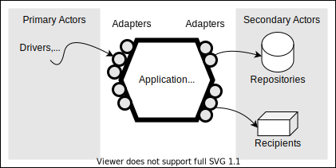
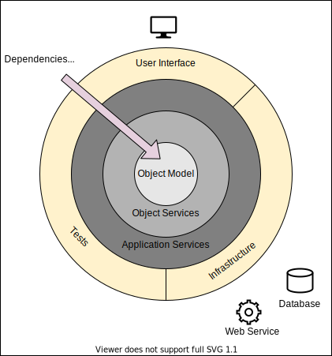

# About

This repository contains a very simple example project to explore the application of a (monolithic) Ports and Adapter Pattern / Hexagonal Architecture. It uses golang (1.18 with generics) for it's implementation.

Tries to give an answer if in an example code one can find: "error handling omitted for simplicity".

The service represents a very simple URL shortener service. Offers basic CRD (create, read, delete) operations via REST.

Based on the series from [tensor-programming](https://github.com/tensor-programming/hex-microservice.git) and recommendations from:

- [How do you structure your Go apps? - Kat Zień](https://github.com/katzien/go-structure-examples)
- [Improving the code from the official Go RESTful API tutorial - Ben Hoyt](https://benhoyt.com/writings/web-service-stdlib/)

# Disclaimer

The implementation in this repository ~~could be a little~~ _is_ over-engineered for such a simple project. It exists mostly for its educational purpose and as an experiment to break with traditional approaches (e.g. the active record pattern, ORM, storing JSON in redis, coupling of the domain and the entities).

## Golang 1.18

As of today (January, 2022), golang 1.18 with generics is not yet released, but betas are available. Please refer to: https://go.dev/blog/go1.18beta2

### Install gotip

```
go install golang.org/dl/go1.18beta2@latest
go1.18beta2 download
```

### Install latest gopls

1. Either in Codium / VS Studio Code: "Go: Install/Update Tools"

2. Or manually. Example for POSIX based systems:

```
mkdir /tmp/gopls && cd "$_"
gotip mod init gopls-unstable
gotip get golang.org/x/tools/gopls@master golang.org/x/tools@master
gotip install golang.org/x/tools/gopls
```

### Configure VSCode/Codium

1. View > Command Palette
2. Go: choose Go environment
3. select go1.18beta2

# Structure of the project

The project follows the recommendations from [Kat Zień](https://github.com/katzien/go-structure-examples) how to structure golang programs in the "domain" fashion. Please refer to her talks about the reasoning why separating services into own folders.


# Computer Science Background

## A case for software architecture

As of now, most software is (still) developed by humans (or synthetics like [copilot](https://copilot.github.com/)) in the form of text files or meshed boxes (e.g. "no-code", node-red). The software is then somehow interpreted and executed by a computing instance (CPU, GPU). While the computing instance does not care about the structure of the software, the ones responsible for its development or maintenance (should) care. There is no clear distinction between the terms: software design and software architecture, but both describes how a software is structured in the small and in the large. The terms became even more funny if "common characteristics of good examples" ([Alistair in the "Hexagone"](https://youtu.be/th4AgBcrEHA)) became "design patterns" (thanks to [Christopher Alexander](https://en.wikipedia.org/wiki/Christopher_Alexander)). One can spent a whole career in this domain (e.g. https://www.martinfowler.com/architecture/).

There are several publications and technologies around architecture/design/patterns like: the [POSA](http://www.dre.vanderbilt.edu/~schmidt/POSA/) series, [MVC](https://en.wikipedia.org/wiki/Model%E2%80%93view%E2%80%93controller), [MVVC](https://en.wikipedia.org/wiki/Model%E2%80%93view%E2%80%93viewmodel), [about React](https://stackoverflow.com/questions/53729411/why-isnt-react-considered-mvc), [layered architecture](https://en.wikipedia.org/wiki/Multitier_architecture), [SOA](https://en.wikipedia.org/wiki/Service-oriented_architecture), [ESB](https://en.wikipedia.org/wiki/Enterprise_service_bus), [micro services](https://en.wikipedia.org/wiki/Microservices), ...

## Ports and Adapters aka Hexagon Architecture

A (not so) recent addition to the attempt to find ~~the holy grail~~ a way for: "faster delivery of new features" ([fowler](https://www.martinfowler.com/architecture/)), is the ports and adapter architecture/pattern (https://web.archive.org/web/20060711221010/http://alistair.cockburn.us:80/index.php/Hexagonal_architecture) by Alistair Cockburn from 2005. It's better known by its working title "Hexagonal Architecture".

In the end it boils down to: "ports are interfaces" ([Alistair in the "Hexagone"](https://youtu.be/th4AgBcrEHA)) and the name was chosen "because it had to be a noun" and:

> The hexagon is intended to visually highlight:
>
> (a) the inside-outside asymmetry and the similar nature of ports, to get away from the
> one-dimensional layered picture and all that evokes, and
>
> (b) the presence of a defined number of different ports - two, three, or four (four is
> most I have encountered to date).
>
> The hexagon is not a hexagon because the number six is important, but rather to allow the
> people doing the drawing to have room to insert ports and adapters as they need, not
> being constrained by a one-dimensional layered drawing. The term hexagonal architecture
> comes from this visual effect.



The hexagon architecture follows the `input -> compute -> output` pattern, except that it's called: `primary actors -> application -> secondary actors`. The parts are accessible via ports/interfaces.

### Onion Architecture

Another architectural style was defined by Jeffrey Palermo a few years later in 2008 called the [Onion Architecture](https://jeffreypalermo.com/2008/07/the-onion-architecture-part-1/). It's not longer shaped as a hexagon, but as concentric circles and resembles the UNIX architecture ([one of many diagrams](https://unix.stackexchange.com/a/87734)).



"This architecture is unashamedly biased toward object-oriented programming, and it puts objects before all others." according to its creator. The basic idea that in its center lies the Domain Model (Domain-Driven Design, Eric Evans, 2004) that represents the state and behavior of the application. Each additional layer encloses the domain and adds more behavior. The first layer around the Domain Model provides interfaces for saving and retrieving data (Objects) via a repository. The interface decouples the Domain Model from the concrete database which resides outside of the Domain Model.

> Hexagonal architecture and Onion Architecture share the following premise:
> Externalize infrastructure and write adapter code so that the infrastructure
> does not become tightly coupled.

# Further reading/watching

- [Steve Francia - Go: building on the shoulders of giants and stepping on a few toes](https://youtu.be/sX8r6zATHGU)
- [Rob Pike - Simplicity is Complicated](https://youtu.be/rFejpH_tAHM)
- [Dave Cheney - SOLID Go Design](https://youtu.be/zzAdEt3xZ1M)

# Todo and Ideas

- implement and test mongo backend
- ~~implement and test other routers than `chi`~~
- implement the code generator that creates the conversion code that performs the conversion without runtime inspection (reflection)
- compare this custom golang lib version (this) with an existing framework like spring boot (e.g. input validation)
- handle key collisions
- dockerize (also for macOS)
- docker-compose with different storage backends
- custom short ids
- time to live (ttl)
- top10 (update on read)
- internal event sourcing to simulate Command and Query Responsibility Segregation (CQRS)?

# Building behind a corporate proxy

If the docker image is build behind a corporate proxy, one can either use the global instance or a local proxy running on localhost (e.g. CNTLM). Either way, the proxy can be configured with the environment variable `CONTAINER_HTTP_PROXY` and `CONTAINER_HTTPS_PROXY`. The [Task](https://taskfile.dev) process `task docker` will set the proxy variables based on this variables.

If the setup is by coincidence Windows 10 with WSL2 and docker installed inside a WSL distro (not the docker desktop client), placing the following code in the `.bashrc`:

```bash
IP="$(ip -o -4 a | awk '$2 == "eth0" { gsub(/\/.*/, "", $4); print $4 }')"

export CONTAINER_HTTP_PROXY_SERVER="${IP}"
export CONTAINER_HTTP_PROXY_PORT="3128"
export CONTAINER_HTTP_PROXY="http://${IP}:${CONTAINER_HTTP_PROXY_PORT}"
export CONTAINER_HTTPS_PROXY="http://${IP}:${CONTAINER_HTTP_PROXY_PORT}"
```

This snippet provides the environment variables `CONTAINER_HTTP_PROXY` and `CONTAINER_HTTPS_PROXY` for the interactive shell with the current IP address of the WSL2 host. It seams like that the IP addresses are not fixed and change from startup to startup. This makes calling `task docker` transparent if a proxy is used or not.

If the corporate proxy is an intercepting man-in-the-middle (MITM) proxy, the secure connection can't be verified during downloading the dependencies. Instead of ignoring security completely, the certificate of the MITM-proxy must be added to the docker container. Conveniently placing the `*.crt` certificate files in the `certificates` folder will automatically used during build. These certificates will not be available in the final docker image.

# Running the docker file locally

`docker run --rm -it -p 8000:8000 --env "BIND=:8000" crra/hex-microservice`

NOTE: The `--env "BIND=:8000"` is required due to the default bind value which binds to localhost only.
